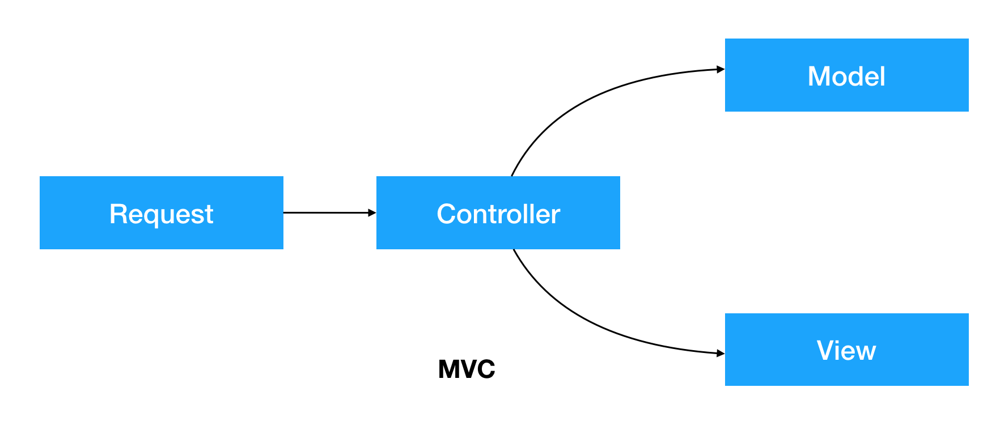
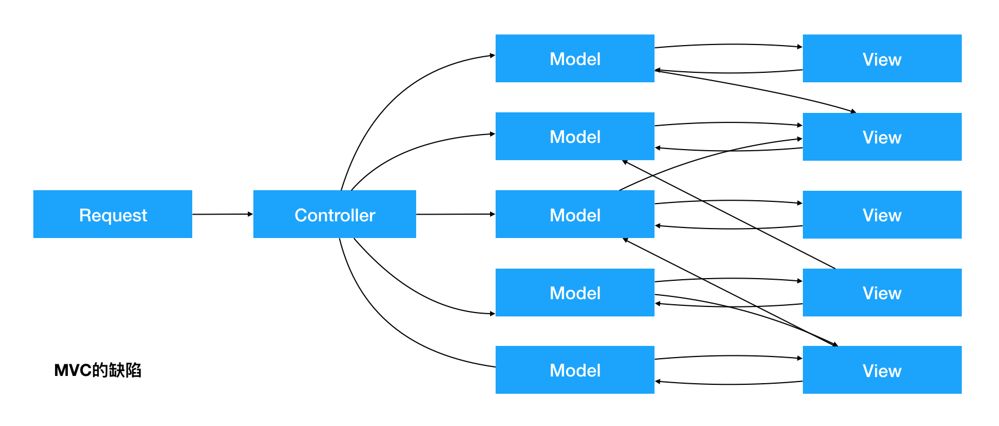
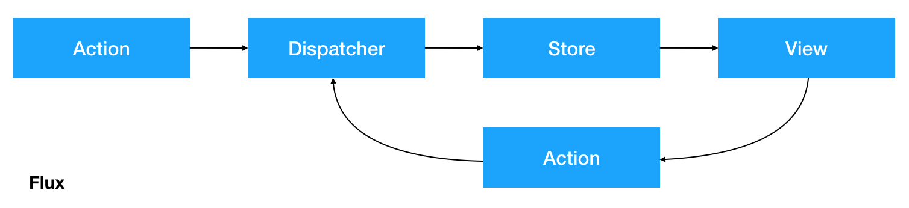
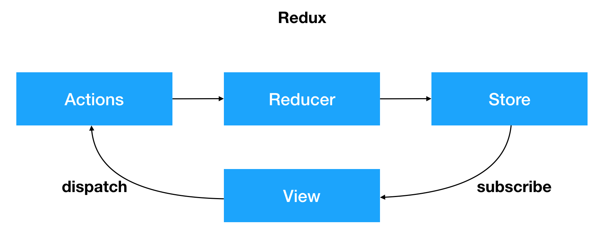
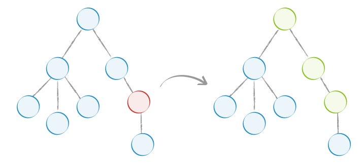

# Webpack

*webpack* 是一个现代 JavaScript 应用程序的*静态模块打包器(module bundler)*。当 webpack 处理应用程序时，它会递归地构建一个*依赖关系图(dependency graph)*，其中包含应用程序需要的每个模块，然后将所有这些模块打包成一个或多个 *bundle*

其它相似打包工具还有[rollup.js](<https://www.rollupjs.com/guide/zh>) 、 [parcel](<https://parceljs.org/>)、[FIS](<http://fis.baidu.com/>)等


按照[webpack的指南](<https://www.webpackjs.com/guides/>)**(注意是指南不是概念不是api)**进行针对性的讲解即可，需要被充一下工程化的知识


## 工程化

这个部分的内容可以做为一些思想给学员讲解，不需要学员掌握。可以理解为扩展的内容

### 什么是JS项目工程化

- 版本控制
- 自动化持续继承、持续交付(CI/CD)
- 代码质量控制(QA)
- 工具
- 模块化
- 文档
- demo

### 编译过程

自动化处理每次push, tag, release的任务队列

1. 安装
   - 安装 : npm命令行工具
   - 安全审计：npm audit
2. Lint 
   - 格式检查: eslint/stylelint
   - 格式化: prettier
3. 测试
   - 测试套装: jest / mocha / ava / kamar
   - 代码覆盖量: nyc / codecov / coveralls
4. 构建
   - 转换器: babel / TS / flow
   - 预处理器: sass / less / postcss
   - 代码混淆: uglify-js / terser
   - 打包及tree shaking: webpack / rollup / parcel
   - 压缩(gzip等)
   - 复制 / 删除 / 移动文件
   - 检查打包文件的大小
   - 移除无用的代码
5. push
   - 交付:  git 
   - 发布: npm
6. 部署
   - 服务器
     - Pages: git pages
     - 云服务器: aliyun / qcloud / aws
7. Story Book

## create-react-app

全局安装create-react-app

```sh
$ npm install -g create-react-app
```

创建一个项目

```sh
$ create-react-app your-app 注意命名方式

Creating a new React app in /dir/your-app.

Installing packages. This might take a couple of minutes. 安装过程较慢，可以推荐学员使用yarn
Installing react, react-dom, and react-scripts... 
```

如果不想全局安装，可以直接使用npx

```sh
$ npx create-react-app your-app	也可以实现相同的效果
```


这需要等待一段时间，这个过程实际上会安装三个东西

- react:  react的顶级库
- react-dom: 因为react有很多的运行环境，比如app端的react-native, 我们要在web上运行就使用react-dom
- react-scripts: 包含运行和打包react应用程序的所有脚本及配置

出现下面的界面，表示创建项目成功:

```sh
Success! Created your-app at /dir/your-app
Inside that directory, you can run several commands:

  npm start
    Starts the development server.

  npm run build
    Bundles the app into static files for production.

  npm test
    Starts the test runner.

  npm run eject
    Removes this tool and copies build dependencies, configuration files
    and scripts into the app directory. If you do this, you can’t go back!

We suggest that you begin by typing:

  cd your-app
  npm start

Happy hacking!
```

根据上面的提示，通过`cd your-app`命令进入目录并运行`npm start`即可运行项目。

生成项目的目录结构如下：

```sh
├── README.md							使用方法的文档
├── node_modules					所有的依赖安装的目录
├── package-lock.json			锁定安装时的包的版本号,保证团队的依赖能保证一致。
├── package.json					
├── public								静态公共目录
└── src										开发用的源代码目录
```


常见问题：

- npm安装失败
  - 切换为npm镜像为淘宝镜像
  - 使用yarn，如果本来使用yarn还要失败，还得把yarn的源切换到国内
  - 如果还没有办法解决，请删除node_modules及package-lock.json然后重新执行`npm install命令`
  - 再不能解决就删除node_modules及package-lock.json的同时清除npm缓存`npm cache clean --force`之后再执行`npm install`命令

# 关于React

React部分的内容包含了所有授课的思路

## React的起源和发展

React 起源于 Facebook 的内部项目，因为该公司对市场上所有 JavaScript MVC 框架，都不满意，就决定自己写一套，用来架设Instagram 的网站。做出来以后，发现这套东西很好用，就在2013年5月开源了。

## React与传统MVC的关系

轻量级的视图层**库**！*A JavaScript library for building user interfaces*

React不是一个完整的MVC框架，最多可以认为是MVC中的V（View），甚至React并不非常认可MVC开发模式；React 构建页面 UI 的库。可以简单地理解为，React 将将界面分成了各个独立的小块，每一个块就是组件，这些组件之间可以组合、嵌套，就成了我们的页面。

## React高性能的体现：虚拟DOM

##### React高性能的原理：

在Web开发中我们总需要将变化的数据实时反应到UI上，这时就需要对DOM进行操作。而复杂或频繁的DOM操作通常是性能瓶颈产生的原因（如何进行高性能的复杂DOM操作通常是衡量一个前端开发人员技能的重要指标）。

React为此引入了虚拟DOM（Virtual DOM）的机制：在浏览器端用Javascript实现了一套DOM API。基于React进行开发时所有的DOM构造都是通过虚拟DOM进行，每当数据变化时，React都会重新构建整个DOM树，然后React将当前整个DOM树和上一次的DOM树进行对比，得到DOM结构的区别，然后仅仅将需要变化的部分进行实际的浏览器DOM更新。而且React能够批处理虚拟DOM的刷新，在一个事件循环（Event Loop）内的两次数据变化会被合并，例如你连续的先将节点内容从A-B,B-A，React会认为A变成B，然后又从B变成A  UI不发生任何变化，而如果通过手动控制，这种逻辑通常是极其复杂的。

尽管每一次都需要构造完整的虚拟DOM树，但是因为虚拟DOM是内存数据，性能是极高的，部而对实际DOM进行操作的仅仅是Diff分，因而能达到提高性能的目的。这样，在保证性能的同时，开发者将不再需要关注某个数据的变化如何更新到一个或多个具体的DOM元素，而只需要关心在任意一个数据状态下，整个界面是如何Render的。

##### React Fiber:

在react 16之后发布的一种react 核心算法，**React Fiber是对核心算法的一次重新实现**(官网说法)。之前用的是diff算法。

在之前React中，更新过程是同步的，这可能会导致性能问题。

当React决定要加载或者更新组件树时，会做很多事，比如调用各个组件的生命周期函数，计算和比对Virtual DOM，最后更新DOM树，这整个过程是同步进行的，也就是说只要一个加载或者更新过程开始，中途不会中断。因为JavaScript单线程的特点，如果组件树很大的时候，每个同步任务耗时太长，就会出现卡顿。

React Fiber的方法其实很简单——分片。把一个耗时长的任务分成很多小片，每一个小片的运行时间很短，虽然总时间依然很长，但是在每个小片执行完之后，都给其他任务一个执行的机会，这样唯一的线程就不会被独占，其他任务依然有运行的机会。

## React的特点和优势

1. 虚拟DOM

我们以前操作dom的方式是通过document.getElementById()的方式，这样的过程实际上是先去读取html的dom结构，将结构转换成变量，再进行操作

而reactjs定义了一套变量形式的dom模型，一切操作和换算直接在变量中，这样减少了操作真实dom，性能真实相当的高，和主流MVC框架有本质的区别，并不和dom打交道

2. 组件系统

react最核心的思想是将页面中任何一个区域或者元素都可以看做一个组件 component

那么什么是组件呢？

组件指的就是同时包含了html、css、js、image元素的聚合体

使用react开发的核心就是将页面拆分成若干个组件，并且react一个组件中同时耦合了css、js、image，这种模式整个颠覆了过去的传统的方式

3. 单向数据流

其实reactjs的核心内容就是数据绑定，所谓数据绑定指的是只要将一些服务端的数据和前端页面绑定好，开发者只关注实现业务就行了

4. JSX  语法

在vue中，我们使用render函数来构建组件的dom结构性能较高，因为省去了查找和编译模板的过程，但是在render中利用createElement创建结构的时候代码可读性较低，较为复杂，此时可以利用jsx语法来在render中创建dom，解决这个问题，但是前提是需要使用工具来编译jsx


# 编写第一个react应用程序

react开发需要引入多个依赖文件：react.js、react-dom.js，分别又有开发版本和生产版本，create-react-app里已经帮我们把这些东西都安装好了。把通过CRA创建的工程目录下的src目录清空，然后在里面重新创建一个index.js. 写入以下代码:

```jsx
// 从 react 的包当中引入了 React。只要你要写 React.js 组件就必须引入React, 因为react里有一种语法叫JSX，稍后会讲到JSX，要写JSX，就必须引入React
import React from 'react'
// ReactDOM 可以帮助我们把 React 组件渲染到页面上去，没有其它的作用了。它是从 react-dom 中引入的，而不是从 react 引入。
import ReactDOM from 'react-dom'

// ReactDOM里有一个render方法，功能就是把组件渲染并且构造 DOM 树，然后插入到页面上某个特定的元素上
ReactDOM.render(
// 这里就比较奇怪了，它并不是一个字符串，看起来像是纯 HTML 代码写在 JavaScript 代码里面。语法错误吗？这并不是合法的 JavaScript 代码, “在 JavaScript 写的标签的”语法叫 JSX- JavaScript XML。
  <h1>欢迎进入React的世界</h1>,
// 渲染到哪里
  document.getElementById('root')
)
```

# 元素与组件

如果代码多了之后，不可能一直在render方法里写，所以就需要把里面的代码提出来，定义一个变量，像这样：

```jsx
import React from 'react'
import ReactDOM from 'react-dom'
// 这里感觉又不习惯了？这是在用JSX定义一下react元素
const app = <h1>欢迎进入React的世界</h1>
ReactDOM.render(
  app,
  document.getElementById('root')
)
```

## 函数式组件

由于元素没有办法传递参数，所以我们就需要把之前定义的变量改为一个方法，让这个方法去return一个元素:

```jsx
import React from 'react'
import ReactDOM from 'react-dom'

// 特别注意这里的写法，如果要在JSX里写js表达式(只能是表达式，不能流程控制)，就需要加 {}，包括注释也是一样，并且可以多层嵌套
const app = (props) => <h1>欢迎进入{props.name}的世界</h1>

ReactDOM.render(
  app({
    name: 'react'
  }),
  document.getElementById('root')
)
```

这里我们定义的方法实际上也是react定义组件的第一种方式-定义函数式组件，这也是无状态组件。但是这种写法不符合react的jsx的风格，更好的方式是使用以下方式进行改造

```jsx
import React from 'react'
import ReactDOM from 'react-dom'

const App = (props) => <h1>欢迎进入{props.name}的世界</h1>

ReactDOM.render(
  // React组件的调用方式
  <App name="react" />,
  document.getElementById('root')
)
```

这样一个完整的函数式组件就定义好了。但要**注意！注意！注意！**组件名必须**大写**，否则报错。

## class组件

ES6的加入让JavaScript直接支持使用class来定义一个类，react的第二种创建组件的方式就是使用的类的继承，`ES6 class`是目前官方推荐的使用方式，它使用了ES6标准语法来构建，看以下代码：

```jsx
import React from 'react'
import ReactDOM from 'react-dom'

class App extends React.Component {
  render () {
    return (
      // 注意这里得用this.props.name, 必须用this.props
      <h1>欢迎进入{this.props.name}的世界</h1>
  	)
  }
}
ReactDOM.render(
  <App name="react" />,
  document.getElementById('root')
)
```

运行结果和之前完全一样，因为JS里没有真正的class，这个class只是一个语法糖, 但二者的运行机制底层运行机制不一样。

- 函数式组件是直接调用, 在前面的代码里已经有看到

- ```es6 class```组件其实就是一个构造器,每次使用组件都相当于在实例化组件，像这样：

  ```jsx
  import React from 'react'
  import ReactDOM from 'react-dom'
  
  class App extends React.Component {
    render () {
      return (
    		<h1>欢迎进入{this.props.name}的世界</h1>
    	)
    }
  }
  
  const app = new App({
    name: 'react'
  }).render()
  
  ReactDOM.render(
    app,
    document.getElementById('root')
  )
  ```

## 更老的一种方法

在16以前的版本还支持这样创建组件, 但现在的项目基本上不用

```jsx
React.createClass({
  render () {
    return (
      <div>{this.props.xxx}</div>
  	)
  }
})
```

## 组件的组合、嵌套

将一个组件渲染到某一个节点里的时候，会将这个节点里原有内容覆盖

组件嵌套的方式就是将子组件写入到父组件的模板中去，且react没有Vue中的内容分发机制（slot），所以我们在一个组件的模板中只能看到父子关系

```jsx
// 从 react 的包当中引入了 React 和 React.js 的组件父类 Component
// 还引入了一个React.js里的一种特殊的组件 Fragment
import React, { Component, Fragment } from 'react'
import ReactDOM from 'react-dom'

class Title extends Component {
  render () {
    return (
      <h1>欢迎进入React的世界</h1>
  	)
  }
}
class Content extends Component {
  render () {
    return (
      <p>React.js是一个构建UI的库</p>
  	)
  }
}
/** 由于每个React组件只能有一个根节点，所以要渲染多个组件的时候，需要在最外层包一个容器，如果使用div, 会生成多余的一层dom
class App extends Component {
  render () {
    return (
    	<div>
    		<Title />
        <Content />
      </div>
  	)
  }
}
**/
// 如果不想生成多余的一层dom可以使用React提供的Fragment组件在最外层进行包裹
class App extends Component {
  render () {
    return (
      <Fragment>
      	<Title />
        <Content />
      </Fragment>
  	)
  }
}
ReactDOM.render(
  <App/>,
  document.getElementById('root')
)
```

# JSX 原理

要明白JSX的原理，需要先明白如何用 JavaScript 对象来表现一个 DOM 元素的结构?

看下面的DOM结构

```html
<div class='app' id='appRoot'>
  <h1 class='title'>欢迎进入React的世界</h1>
  <p>
    React.js 是一个帮助你构建页面 UI 的库
  </p>
</div>
```

上面这个 HTML 所有的信息我们都可以用 JavaScript 对象来表示：

```js
{
  tag: 'div',
  attrs: { className: 'app', id: 'appRoot'},
  children: [
    {
      tag: 'h1',
      attrs: { className: 'title' },
      children: ['欢迎进入React的世界']
    },
    {
      tag: 'p',
      attrs: null,
      children: ['React.js 是一个构建页面 UI 的库']
    }
  ]
}
```

但是用 JavaScript 写起来太长了，结构看起来又不清晰，用 HTML 的方式写起来就方便很多了。

于是 React.js 就把 JavaScript 的语法扩展了一下，让 JavaScript 语言能够支持这种直接在 JavaScript 代码里面编写类似 HTML 标签结构的语法，这样写起来就方便很多了。编译的过程会把类似 HTML 的 JSX 结构转换成 JavaScript 的对象结构。

下面代码:

```jsx
import React from 'react'
import ReactDOM from 'react-dom'

class App extends React.Component {
  render () {
    return (
      <div className='app' id='appRoot'>
        <h1 className='title'>欢迎进入React的世界</h1>
        <p>
          React.js 是一个构建页面 UI 的库
        </p>
      </div>
    )
  }
}

ReactDOM.render(
	<App />,
  document.getElementById('root')
)
```

编译之后将得到这样的代码:

```jsx
import React from 'react'
import ReactDOM from 'react-dom'

class App extends React.Component {
  render () {
    return (
      React.createElement(
        "div",
        {
          className: 'app',
          id: 'appRoot'
        },
        React.createElement(
          "h1",
          { className: 'title' },
          "欢迎进入React的世界"
        ),
        React.createElement(
          "p",
          null,
          "React.js 是一个构建页面 UI 的库"
        )
      )
    )
  }
}

ReactDOM.render(
	React.createElement(App),
  document.getElementById('root')
)
```

`React.createElement` 会构建一个 JavaScript 对象来描述你 HTML 结构的信息，包括标签名、属性、还有子元素等, 语法为

```jsx
React.createElement(
  type,
  [props],
  [...children]
)
```

所谓的 JSX 其实就是 JavaScript 对象，所以使用 React 和 JSX 的时候一定要经过编译的过程:

> JSX —使用react构造组件，bable进行编译—> JavaScript对象 — `ReactDOM.render()`—>DOM元素 —>插入页面

# 组件中DOM样式

- 行内样式

想给虚拟dom添加行内样式，需要使用表达式传入样式对象的方式来实现：

```jsx
// 注意这里的两个括号，第一个表示我们在要JSX里插入JS了，第二个是对象的括号
 <p style={{color:'red', fontSize:'14px'}}>Hello world</p>
```

行内样式需要写入一个样式对象，而这个样式对象的位置可以放在很多地方，例如`render`函数里、组件原型上、外链js文件中

- 使用`class`

React推荐我们使用行内样式，因为React觉得每一个组件都是一个独立的整体

其实我们大多数情况下还是大量的在为元素添加类名，但是需要注意的是，`class`需要写成`className`（因为毕竟是在写类js代码，会收到js规则的现在，而`class`是关键字）

```jsx
<p className="hello" style = {this.style}>Hello world</p>
```

- 不同的条件添加不同的样式

有时候需要根据不同的条件添加不同的样式，比如：完成状态，完成是绿色，未完成是红色。那么这种情况下，我们推荐使用[classnames](<https://www.npmjs.com/package/classnames>)这个包：

- css-in-js

`styled-components`是针对React写的一套css-in-js框架，简单来讲就是在js中写css。[npm链接](<https://www.npmjs.com/package/styled-components>)

# TodoList

组件化开发React todolist， 项目开发中的组件的基本目录结构基本上是这样的：

> /your-project
>
> - src
>   - …
>   - components
>     - YourComponentOne
>       - index.js/YourComponentOne.js
>     - YourComponentTwo
>       - index.js/YourComponentTwo.js
>     - index.js 用于导出组件

注意：一个组件只干一件事情 ，所以TodoList和TodoItem要做成两个组件，这样也方便于后期理解shouldComponentUpdate

# 组件的数据挂载方式

## 属性(props)

`props`是正常是外部传入的，组件内部也可以通过一些方式来初始化的设置，属性不能被组件自己更改，但是你可以通过父组件主动重新渲染的方式来传入新的 `props`

属性是描述性质、特点的，组件自己不能随意更改。

之前的组件代码里面有`props`的简单使用，总的来说，在使用一个组件的时候，可以把参数放在标签的属性当中，所有的属性都会作为组件 `props` 对象的键值。通过箭头函数创建的组件，需要通过函数的参数来接收`props`:

```jsx
import React, { Component, Fragment } from 'react'
import ReactDOM from 'react-dom'

class Title extends Component {
  render () {
    return (
  		<h1>欢迎进入{this.props.name}的世界</h1>
  	)
  }
}

const Content = (props) => {
  return (
    <p>{props.name}是一个构建UI的库</p>
  )
}

class App extends Component {
  render () {
    return (
  		<Fragment>
      	<Title name="React" />
        <Content name="React.js" />
      </Fragment>
  	)
  }
}

ReactDOM.render(
	<App/>,
  document.getElementById('root')
)
```

### 设置组件的默认props

```jsx
import React, { Component, Fragment } from 'react'
import ReactDOM from 'react-dom'

class Title extends Component {
  // 使用类创建的组件，直接在这里写static方法，创建defaultProps
  static defaultProps = {
    name: 'React'
  }
  render () {
    return (
  		<h1>欢迎进入{this.props.name}的世界</h1>
  	)
  }
}

const Content = (props) => {
  return (
    <p>{props.name}是一个构建UI的库</p>
  )
}

// 使用箭头函数创建的组件，需要在这个组件上直接写defaultProps属性
Content.defaultProps = {
  name: 'React.js'
}

class App extends Component {
  render () {
    return (
  		<Fragment>
        {/* 由于设置了defaultProps， 不传props也能正常运行，如果传递了就会覆盖defaultProps的值 */}
      	<Title />
        <Content />
      </Fragment>
  	)
  }
}

ReactDOM.render(
	<App/>,
  document.getElementById('root')
)
```

### props.children

我们知道使用组件的时候，可以嵌套。要在自定义组件的使用嵌套结构，就需要使用 `props.children` 。在实际的工作当中，我们几乎每天都需要用这种方式来编写组件。

```jsx
import React, { Component, Fragment } from 'react'
import ReactDOM from 'react-dom'

class Title extends Component {
  render () {
    return (
  		<h1>欢迎进入{this.props.children}的世界</h1>
  	)
  }
}

const Content = (props) => {
  return (
    <p>{props.children}</p>
  )
}

class App extends Component {
  render () {
    return (
  		<Fragment>
      	<Title>React</Title>
        <Content><i>React.js</i>是一个构建UI的库</Content>
      </Fragment>
  	)
  }
}

ReactDOM.render(
	<App/>,
  document.getElementById('root')
)
```

### 使用prop-types检查props

React其实是为了构建大型应用程序而生, 在一个大型应用中，根本不知道别人使用你写的组件的时候会传入什么样的参数，有可能会造成应用程序运行不了，但是不报错。为了解决这个问题，React提供了一种机制，让写组件的人可以给组件的```props```设定参数检查，需要安装和使用[prop-types](<https://www.npmjs.com/package/prop-types>):

```sh
$ npm i prop-types -S
```

## 状态(state)

状态就是组件描述某种显示情况的数据，由组件自己设置和更改，也就是说由组件自己维护，使用状态的目的就是为了在不同的状态下使组件的显示不同(自己管理)

### 定义state

第一种方式

```jsx
import React, { Component } from 'react'
import ReactDOM from 'react-dom'

class App extends Component {
  state = {
    name: 'React',
    isLiked: false
  }
  render () {
    return (
      <div>
        <h1>欢迎来到{this.state.name}的世界</h1>
        <button>
          {
            this.state.isLiked ? '❤️取消' : '🖤收藏'
          }
        </button>
      </div>
  	)
  }
}
ReactDOM.render(
	<App/>,
  document.getElementById('root')
)
```

另一种方式(推荐)

```jsx
import React, { Component } from 'react'
import ReactDOM from 'react-dom'

class App extends Component {
  constructor() {
    super()
    this.state = {
      name: 'React',
      isLiked: false
    }
  }
  render () {
    return (
  		<div>
        <h1>欢迎来到{this.state.name}的世界</h1>
        <button>
          {
            this.state.isLiked ? '❤️取消' : '🖤收藏'
          }
        </button>
      </div>
  	)
  }
}
ReactDOM.render(
  <App/>,
  document.getElementById('root')
)
```

`this.props`和`this.state`是纯js对象,在vue中，data属性是利用`Object.defineProperty`处理过的，更改​data的数据的时候会触发数据的`getter`和`setter`，但是React中没有做这样的处理，如果直接更改的话，react是无法得知的，所以，需要使用特殊的更改状态的方法`setState`。

### setState

`isLiked` 存放在实例的 `state` 对象当中，组件的 `render` 函数内，会根据组件的 `state` 的中的`isLiked`不同显示“取消”或“收藏”内容。下面给 `button` 加上了点击的事件监听。

```jsx
import React, { Component } from 'react'
import ReactDOM from 'react-dom'

class App extends Component {
  constructor() {
    super()
    this.state = {
      name: 'React',
      isLiked: false
    }
  }
  handleBtnClick = () => {
    this.setState({
      isLiked: !this.state.isLiked
    })
  }
  render () {
    return (
      <div>
        <h1>欢迎来到{this.state.name}的世界</h1>
        <button onClick={this.handleBtnClick}>
          {
            this.state.isLiked ? '❤️取消' : '🖤收藏'
          }
        </button>
      </div>
  	)
  }
}
ReactDOM.render(
	<App/>,
  document.getElementById('root')
)
```

`setState`有两个参数

第一个参数可以是对象，也可以是方法return一个对象，我们把这个参数叫做`updater`

- 参数是对象

  ```jsx
  this.setState({
    isLiked: !this.state.isLiked
  })
  ```

- 参数是方法

  ```jsx
  this.setState((prevState, props) => {
    return {
      isLiked: !prevState.isLiked
    }
  })
  ```

  注意的是这个方法接收两个参数，第一个是上一次的state, 第二个是props

`setState`是异步的，所以想要获取到最新的state，没有办法获取，就有了第二个参数，这是一个可选的回调函数

```jsx
this.setState((prevState, props) => {
  return {
    isLiked: !prevState.isLiked
  }
}, () => {
  console.log('回调里的',this.state.isLiked)
})
console.log('setState外部的',this.state.isLiked)
```

## 属性vs状态

相似点：都是纯js对象，都会触发render更新，都具有确定性（状态/属性相同，结果相同）

不同点： 

1. 属性能从父组件获取，状态不能
2. 属性可以由父组件修改，状态不能
3. 属性能在内部设置默认值，状态也可以
4. 属性不在组件内部修改，状态要改
5. 属性能设置子组件初始值，状态不可以
6. 属性可以修改子组件的值，状态不可以

`state` 的主要作用是用于组件保存、控制、修改自己的可变状态。`state` 在组件内部初始化，可以被组件自身修改，而外部不能访问也不能修改。你可以认为 `state` 是一个局部的、只能被组件自身控制的数据源。`state` 中状态可以通过 `this.setState`方法进行更新，`setState` 会导致组件的重新渲染。

`props` 的主要作用是让使用该组件的父组件可以传入参数来配置该组件。它是外部传进来的配置参数，组件内部无法控制也无法修改。除非外部组件主动传入新的 `props`，否则组件的 `props` 永远保持不变。

如果搞不清 `state` 和 `props` 的使用场景，记住一个简单的规则：**尽量少地用 `state`，多用 `props`**。

没有 `state` 的组件叫无状态组件（stateless component），设置了 state 的叫做有状态组件（stateful component）。因为状态会带来管理的复杂性，我们尽量多地写无状态组件，尽量少地写有状态的组件。这样会降低代码维护的难度，也会在一定程度上增强组件的可复用性。

## 状态提升

如果有多个组件共享一个数据，把这个数据放到共同的父级组件中来管理

## 受控组件与非受控组件 

React组件的数据渲染是否被调用者传递的`props`完全控制，控制则为受控组件，否则非受控组件。


## 渲染数据

- 条件渲染

  ```jsx
  {
    condition ? '❤️取消' : '🖤收藏'
  }
  ```

- 列表渲染

```jsx
// 数据
const people = [{
  id: 1,
  name: 'Leo',
  age: 35
}, {
  id: 2,
  name: 'XiaoMing',
  age: 16
}]
// 渲染列表
{
  people.map(person => {
    return (
      <dl key={person.id}>
        <dt>{person.name}</dt>
        <dd>age: {person.age}</dd>
      </dl>
    )
  })
}
```

React的高效依赖于所谓的 Virtual-DOM，尽量不碰 DOM。对于列表元素来说会有一个问题：元素可能会在一个列表中改变位置。要实现这个操作，只需要交换一下 DOM 位置就行了，但是React并不知道其实我们只是改变了元素的位置，所以它会重新渲染后面两个元素（再执行 Virtual-DOM ），这样会大大增加 DOM 操作。但如果给每个元素加上唯一的标识，React 就可以知道这两个元素只是交换了位置，这个标识就是```key```，这个 `key` 必须是每个元素唯一的标识

- dangerouslySetHTML

对于富文本创建的内容，后台拿到的数据是这样的：

```js
content = "<p>React.js是一个构建UI的库</p>"
```

处于安全的原因，React当中所有表达式的内容会被转义，如果直接输入，标签会被当成文本。这时候就需要使用`dangerouslySetHTML`属性，它允许我们动态设置`innerHTML`

```jsx
import React, { Component } from 'react'
import ReactDOM from 'react-dom'

class App extends Component {
  constructor() {
    super()
    this.state = {
      content : "<p>React.js是一个构建UI的库</p>"
    }
  }
  render () {
    return (
  		<div
        // 注意这里是两个下下划线 __html
        dangerouslySetInnerHTML={{__html: this.state.content}}
      />
  	)
  }
}
ReactDOM.render(
	<App/>,
  document.getElementById('root')
)
```

# 事件处理

## 绑定事件

采用on+事件名的方式来绑定一个事件，注意，这里和原生的事件是有区别的，原生的事件全是小写`onclick`, React里的事件是驼峰`onClick`，**React的事件并不是原生事件，而是合成事件**。

## 事件handler的写法

- 直接在render里写行内的箭头函数(不推荐)
- 在组件内使用箭头函数定义一个方法(推荐)
- 直接在组件内定义一个非箭头函数的方法，然后在render里直接使用`onClick={this.handleClick.bind(this)}`(不推荐)
- 直接在组件内定义一个非箭头函数的方法，然后在constructor里bind(this)(推荐)

## Event 对象

和普通浏览器一样，事件handler会被自动传入一个 `event` 对象，这个对象和普通的浏览器 `event` 对象所包含的方法和属性都基本一致。不同的是 React中的 `event` 对象并不是浏览器提供的，而是它自己内部所构建的。它同样具有`event.stopPropagation`、`event.preventDefault` 这种常用的方法

## 事件的参数传递

- 在`render`里调用方法的地方外面包一层箭头函数 
- 在`render`里通过`this.handleEvent.bind(this, 参数)`这样的方式来传递
- 通过`event`传递
- 比较推荐的是做一个子组件, 在父组件中定义方法，通过`props`传递到子组件中，然后在子组件件通过`this.props.method`来调用

## 处理用户输入

```jsx
import React, { Component } from 'react'
import ReactDOM from 'react-dom'

class App extends Component {
  constructor() {
    super()
    this.state = {
      xing: '',
      ming: ''
    }
  }
  handleInputChange = (e) => {
    this.setState({
      [e.target.name]: e.target.value
    })
  }
  render () {
    const {
      xing,
      ming
    } = this.state
    return (
  		<div>
        <label>
          <span>姓:</span>
          <input
            type="text"
            name="xing"
            value={xing}
            onChange={this.handleInputChange}
          />
        </label>
        <label>
          <span>名:</span>
          <input
            type="text"
            name="ming"
            value={ming}
            onChange={this.handleInputChange}
          />
        </label>
        <p>欢迎您: {xing}{ming}</p>
      </div>
  	)
  }
}
ReactDOM.render(
	<App/>,
  document.getElementById('root')
)
```

# 组件的生命周期

React中组件也有生命周期，也就是说也有很多钩子函数供我们使用, 组件的生命周期，我们会分为四个阶段，初始化、运行中、销毁、错误处理(16.3之后)

## 初始化

在组件初始化阶段会执行 
1. constructor 
2. static getDerivedStateFromProps()
3. componentWillMount() / UNSAFE_componentWillMount() 
4. render() 
5. componentDidMount()

## 更新阶段

`props`或`state`的改变可能会引起组件的更新，组件重新渲染的过程中会调用以下方法： 

1. componentWillReceiveProps() / UNSAFE_componentWillReceiveProps() 
2. static getDerivedStateFromProps()
3. shouldComponentUpdate() 
4. componentWillUpdate() / UNSAFE_componentWillUpdate() 
5. render() 
6. getSnapshotBeforeUpdate() 
7. componentDidUpdate()

##卸载阶段

1. componentWillUnmount()

##错误处理

1. componentDidCatch()

##各生命周期详解

#####1.constructor(props)

React组件的构造函数在挂载之前被调用。在实现`React.Component`构造函数时，需要先在添加其他内容前，调用`super(props)`，用来将父组件传来的`props`绑定到这个类中，使用`this.props`将会得到。

官方建议不要在`constructor`引入任何具有副作用和订阅功能的代码，这些应当使用`componentDidMount()`。

`constructor`中应当做些初始化的动作，如：初始化`state`，将事件处理函数绑定到类实例上，但也不要使用`setState()`。如果没有必要初始化state或绑定方法，则不需要构造`constructor`，或者把这个组件换成纯函数写法。

当然也可以利用`props`初始化`state`，在之后修改`state`不会对`props`造成任何修改，但仍然建议大家提升状态到父组件中，或使用`redux`统一进行状态管理。

```jsx
constructor(props) {
  super(props);
  this.state = {
    isLiked: props.isLiked
  };
}
```

##### 2.static getDerivedStateFromProps(nextProps, prevState)

`getDerivedStateFromProps` 是react16.3之后新增，在组件实例化后，和接受新的`props`后被调用。他必须返回一个对象来更新状态，或者返回null表示新的props不需要任何state的更新。

如果是由于父组件的`props`更改，所带来的重新渲染，也会触发此方法。

调用`steState()`不会触发`getDerivedStateFromProps()`。

之前这里都是使用`constructor`+`componentWillRecieveProps`完成相同的功能的

#####3. componentWillMount() / UNSAFE_componentWillMount()

`componentWillMount()`将在React未来版本(官方说法 17.0)中被弃用。`UNSAFE_componentWillMount()`在组件挂载前被调用，在这个方法中调用`setState()`不会起作用，是由于他在`render()`前被调用。

为了避免副作用和其他的订阅，官方都建议使用`componentDidMount()`代替。这个方法是用于在服务器渲染上的唯一方法。这个方法因为是在渲染之前被调用，也是惟一一个可以直接同步修改state的地方。

##### 4.render()

render()方法是必需的。当他被调用时，他将计算`this.props`和`this.state`，并返回以下一种类型： 
1. React元素。通过jsx创建，既可以是dom元素，也可以是用户自定义的组件。 
2. 字符串或数字。他们将会以文本节点形式渲染到dom中。 
3. Portals。react 16版本中提出的新的解决方案，可以使组件脱离父组件层级直接挂载在DOM树的任何位置。 
4. null，什么也不渲染 
5. 布尔值。也是什么都不渲染。

当返回`null`,`false`,`ReactDOM.findDOMNode(this)`将会返回null，什么都不会渲染。

`render()`方法必须是一个纯函数，他不应该改变`state`，也不能直接和浏览器进行交互，应该将事件放在其他生命周期函数中。 
如果`shouldComponentUpdate()`返回`false`，`render()`不会被调用。

##### 5. componentDidMount

`componentDidMount`在组件被装配后立即调用。初始化使得DOM节点应该进行到这里。

**通常在这里进行ajax请求**

如果要初始化第三方的dom库，也在这里进行初始化。只有到这里才能获取到真实的dom.

##### 6.componentWillReceiveProps()/UNSAFE_componentWillReceiveProps(nextProps)

官方建议使用`getDerivedStateFromProps`函数代替`componentWillReceiveProps`。当组件挂载后，接收到新的`props`后会被调用。如果需要更新`state`来响应`props`的更改，则可以进行`this.props`和`nextProps`的比较，并在此方法中使用`this.setState()`。

如果父组件会让这个组件重新渲染，即使`props`没有改变，也会调用这个方法。

React不会在组件初始化props时调用这个方法。调用`this.setState`也不会触发。

#####7.shouldComponentUpdate(nextProps, nextState)

调用`shouldComponentUpdate`使React知道，组件的输出是否受`state`和`props`的影响。默认每个状态的更改都会重新渲染，大多数情况下应该保持这个默认行为。

在渲染新的`props`或`state`前，`shouldComponentUpdate`会被调用。默认为`true`。这个方法不会在初始化时被调用，也不会在`forceUpdate()`时被调用。返回`false`不会阻止子组件在`state`更改时重新渲染。

如果`shouldComponentUpdate()`返回`false`，`componentWillUpdate`,`render`和`componentDidUpdate`不会被调用。

> 官方并不建议在`shouldComponentUpdate()`中进行深度查询或使用`JSON.stringify()`，他效率非常低，并且损伤性能。

##### 8.UNSAFE_componentWillUpdate(nextProps, nextState)

在渲染新的`state`或`props`时，`UNSAFE_componentWillUpdate`会被调用，将此作为在更新发生之前进行准备的机会。这个方法不会在初始化时被调用。

*不能在这里使用this.setState()*，也不能做会触发视图更新的操作。如果需要更新`state`或`props`，调用`getDerivedStateFromProps`。

##### 9.getSnapshotBeforeUpdate()

在react `render()`后的输出被渲染到DOM之前被调用。它使您的组件能够在它们被潜在更改之前捕获当前值（如滚动位置）。这个生命周期返回的任何值都将作为参数传递给componentDidUpdate（）。

##### 10.componentDidUpdate(prevProps, prevState, snapshot)

在更新发生后立即调用`componentDidUpdate()`。此方法不用于初始渲染。当组件更新时，将此作为一个机会来操作DOM。只要您将当前的props与以前的props进行比较（例如，如果props没有改变，则可能不需要网络请求），这也是做网络请求的好地方。

如果组件实现`getSnapshotBeforeUpdate()`生命周期，则它返回的值将作为第三个“快照”参数传递给`componentDidUpdate()`。否则，这个参数是`undefined`。

##### 11.componentWillUnmount()

在组件被卸载并销毁之前立即被调用。在此方法中执行任何必要的清理，例如使定时器无效，取消网络请求或清理在`componentDidMount`中创建的任何监听。

##### 12.componentDidCatch(error, info)

错误边界是React组件，可以在其子组件树中的任何位置捕获JavaScript错误，记录这些错误并显示回退UI，而不是崩溃的组件树。错误边界在渲染期间，生命周期方法以及整个树下的构造函数中捕获错误。

如果类组件定义了此生命周期方法，则它将成错误边界。在它中调用`setState()`可以让你在下面的树中捕获未处理的JavaScript错误，并显示一个后备UI。只能使用错误边界从意外异常中恢复; 不要试图将它们用于控制流程。

错误边界只会捕获树中下面组件中的错误。错误边界本身不能捕获错误。

## PureComponent

`PureComponnet`里如果接收到的新属性或者是更改后的状态和原属性、原状态相同的话，就不会去重新render了
在里面也可以使用`shouldComponentUpdate`，而且。是否重新渲染以`shouldComponentUpdate`的返回值为最终的决定因素。

```jsx
import React, { PureComponent } from 'react'

class YourComponent extends PureComponent {
  ……
}
```

## ref

React提供的这个`ref`属性，表示为对组件真正实例的引用，其实就是`ReactDOM.render()`返回的组件实例,`ref`可以挂载到组件上也可以是dom元素上。

- 挂到组件(`class`声明的组件)上的ref表示对组件实例的引用。**不能**在函数式组件上使用 ref 属性，因为它们没有实例：
- 挂载到dom元素上时表示具体的dom元素节点。

在React 最新的版本中，要使用`ref`, 需要使用`React.createRef`方法先生成一个`ref`。

```jsx
import React, { Component, createRef } from 'react'
import ReactDOM from 'react-dom'

class App extends Component {
  constructor() {
    super()
    // 创建inputRef
    this.inputRef=createRef()
  }
  componentDidMount () {
    console.log(this.inputRef.current) // <input type="text">
  }
  render () {
    return (
  		<div>
        {/* 关联ref和dom */}
        <input type="text" ref={this.inputRef} />
      </div>
  	)
  }
}
ReactDOM.render(
	<App/>,
  document.getElementById('root')
)
```

## React Hooks

React Hooks 是 React `16.7.0-alpha` 版本推出的新特性, 有了React Hooks，在 react 函数组件中，也可以使用类组件（classes components）的 state 和 组件生命周期。通过下面几个例子来学习React Hooks。

- State Hook

```jsx
// useState是react包提供的一个方法
import React, { useState } from "react";
import ReactDOM from "react-dom";

const Counter = () => {
  // useState 这个方法可以为我们的函数组件拥有自己的state，它接收一个用于初始 state 的值，返回一对变量。这里我们把计数器的初始值设置为0, 方法都是以set开始
  const [count, setCount] = useState(0);
  return (
    <div>
      <p>你点击了{count}次</p>
      <button onClick={() => setCount(count + 1)}>点击</button>
    </div>
  );
};

const rootElement = document.getElementById("root");

ReactDOM.render(<Counter />, rootElement);
```

-  Effect Hook

```jsx
// useState是react包提供的一个方法
import React, { useState, useEffect } from "react";
import ReactDOM from "react-dom";

const Counter = () => {
  // useState 这个方法可以为我们的函数组件拥有自己的state，它接收一个用于初始 state 的值，返回一对变量。这里我们把计数器的初始值设置为0, 方法都是以set开始
  const [count, setCount] = useState(0);
  // 类似于componentDidMount或者componentDidUpdate:
  useEffect(() => {
    // 更改网页的标题，还可以做其它的监听
    document.title = `你点击了${count}次`;
  });
  return (
    <div>
      <p>你点击了{count}次</p>
      <button onClick={() => setCount(count + 1)}>点击</button>
    </div>
  );
};

const rootElement = document.getElementById("root");

ReactDOM.render(<Counter />, rootElement);
```

- React Hooks 的规则
  - 只能在**顶层**调用Hooks。不要在循环，条件或嵌套函数中调用Hook。
  - 不要从常规JavaScript函数中调用Hook。只在React函数式组件调用Hooks。
- 自定义hooks可以选择讲解
- react 内置hooks api
  - [Basic Hooks](https://reactjs.org/docs/hooks-reference.html#basic-hooks)
    - [`useState`](https://reactjs.org/docs/hooks-reference.html#usestate)
    - [`useEffect`](https://reactjs.org/docs/hooks-reference.html#useeffect)
    - [`useContext`](https://reactjs.org/docs/hooks-reference.html#usecontext)
  - [Additional Hooks](https://reactjs.org/docs/hooks-reference.html#additional-hooks)
    - [`useReducer`](https://reactjs.org/docs/hooks-reference.html#usereducer)
    - [`useCallback`](https://reactjs.org/docs/hooks-reference.html#usecallback)
    - [`useMemo`](https://reactjs.org/docs/hooks-reference.html#usememo)
    - [`useRef`](https://reactjs.org/docs/hooks-reference.html#useref)
    - [`useImperativeHandle`](https://reactjs.org/docs/hooks-reference.html#useimperativehandle)
    - [`useLayoutEffect`](https://reactjs.org/docs/hooks-reference.html#uselayouteffect)
    - [`useDebugValue`](https://reactjs.org/docs/hooks-reference.html#usedebugvalue)

# 组件通信

父组件与子组件通信

- 父组件将自己的状态传递给子组件，子组件当做属性来接收，当父组件更改自己状态的时候，子组件接收到的属性就会发生改变

- 父组件利用`ref`对子组件做标记，通过调用子组件的方法以更改子组件的状态,也可以调用子组件的方法..

子组件与父组件通信

- 父组件将自己的某个方法传递给子组件，在方法里可以做任意操作，比如可以更改状态，子组件通过`this.props`接收到父组件的方法后调用。

跨组件通信

在react没有类似vue中的事件总线来解决这个问题，我们只能借助它们共同的父级组件来实现，将非父子关系装换成多维度的父子关系。react提供了`context` api来实现跨组件通信, React 16.3之后的`context`api较之前的好用。

实例，使用`context` 实现购物车中的加减功能

```jsx
// counterContext.js
import React, { Component, createContext } from 'react'

const {
  Provider,
  Consumer: CountConsumer
} = createContext()

class CountProvider extends Component {
  constructor () {
    super()
    this.state = {
      count: 1
    }
  }
  increaseCount = () => {
    this.setState({
      count: this.state.count + 1
    })
  }
  decreaseCount = () => {
    this.setState({
      count: this.state.count - 1
    })
  }
  render() {
    return (
      <Provider value={{
        count: this.state.count,
        increaseCount: this.increaseCount,
        decreaseCount: this.decreaseCount
      }}
      >
        {this.props.children}
      </Provider>
    )
  }
}

export {
  CountProvider,
  CountConsumer
}
```

```jsx
// 定义CountButton组件
const CountButton = (props) => {
  return (
    <CountConsumer>
      // consumer的children必须是一个方法
      {
        ({ increaseCount, decreaseCount }) => {
          const { type } = props
          const handleClick = type === 'increase' ? increaseCount : decreaseCount
          const btnText = type === 'increase' ? '+' : '-'
          return <button onClick={handleClick}>{btnText}</button>
        }
      }
    </CountConsumer>
  )
}
```

```jsx
// 定义count组件，用于显示数量
const Count = (prop) => {
  return (
    <CountConsumer>
      {
        ({ count }) => {
          return <span>{count}</span>
        }
      }
    </CountConsumer>
  )
}
```

```jsx
// 组合
class App extends Component {
  render () {
    return (
  		<CountProvider>
        <CountButton type='decrease' />
        <Count />
        <CountButton type='increase' />
      </CountProvider>
  	)
  }
}
```

> 复杂的非父子组件通信在react中很难处理，多组件间的数据共享也不好处理，在实际的工作中我们会使用flux、redux、mobx来实现

# HOC(高阶组件)

Higher-Order Components就是一个函数，传给它一个组件，它返回一个新的组件。

```jsx
const NewComponent = higherOrderComponent(YourComponent)
```

比如，我们想要我们的组件通过自动注入一个版权信息。

```jsx
// withCopyright.js 定义一个高阶组件
import React, { Component, Fragment } from 'react'

const withCopyright = (WrappedComponent) => {
  return class NewComponent extends Component {
    render() {
      return (
        <Fragment>
          <WrappedComponent />
          <div>&copy;版权所有 千锋教育 2019 </div>
        </Fragment>
      )
    }
  }
}
export default withCopyright
```

```jsx
// 使用方式
import withCopyright from './withCopyright'

class App extends Component {
  render () {
    return (
  		<div>
        <h1>Awesome React</h1>
        <p>React.js是一个构建用户界面的库</p>
      </div>
  	)
  }
}
const CopyrightApp = withCopyright(App)
```

这样只要我们有需要用到版权信息的组件，都可以直接使用withCopyright这个高阶组件包裹即可。

在这里要讲解在CRA 中配置装饰器模式的支持。

# 状态管理

## 传统MVC框架的缺陷

**什么是MVC？**



`MVC`的全名是`Model View Controller`，是模型(model)－视图(view)－控制器(controller)的缩写，是一种软件设计典范。

`V`即View视图是指用户看到并与之交互的界面。

`M`即Model模型是管理数据 ，很多业务逻辑都在模型中完成。在MVC的三个部件中，模型拥有最多的处理任务。

`C`即Controller控制器是指控制器接受用户的输入并调用模型和视图去完成用户的需求，控制器本身不输出任何东西和做任何处理。它只是接收请求并决定调用哪个模型构件去处理请求，然后再确定用哪个视图来显示返回的数据。

**MVC只是看起来很美**

MVC框架的数据流很理想，请求先到Controller, 由Controller调用Model中的数据交给View进行渲染，但是在实际的项目中，又是允许Model和View直接通信的。然后就出现了这样的结果：



## Flux

在2013年，Facebook让`React`亮相的同时推出了Flux框架，`React`的初衷实际上是用来替代`jQuery`的，`Flux`实际上就可以用来替代`Backbone.js`，`Ember.js`等一系列`MVC`架构的前端JS框架。

其实`Flux`在`React`里的应用就类似于`Vue`中的`Vuex`的作用，但是在`Vue`中，`Vue`是完整的`mvvm`框架，而`Vuex`只是一个全局的插件。

`React`只是一个MVC中的V(视图层)，只管页面中的渲染，一旦有数据管理的时候，`React`本身的能力就不足以支撑复杂组件结构的项目，在传统的`MVC`中，就需要用到Model和Controller。Facebook对于当时世面上的`MVC`框架并不满意，于是就有了`Flux`, 但`Flux`并不是一个`MVC`框架，他是一种新的思想。



- View： 视图层
- ActionCreator（动作创造者）：视图层发出的消息（比如mouseClick）
- Dispatcher（派发器）：用来接收Actions、执行回调函数
- Store（数据层）：用来存放应用的状态，一旦发生变动，就提醒Views要更新页面

Flux的流程：

1. 组件获取到store中保存的数据挂载在自己的状态上
2. 用户产生了操作，调用actions的方法
3. actions接收到了用户的操作，进行一系列的逻辑代码、异步操作
4. 然后actions会创建出对应的action，action带有标识性的属性
5. actions调用dispatcher的dispatch方法将action传递给dispatcher
6. dispatcher接收到action并根据标识信息判断之后，调用store的更改数据的方法
7. store的方法被调用后，更改状态，并触发自己的某一个事件
8. store更改状态后事件被触发，该事件的处理程序会通知view去获取最新的数据

## Redux

React 只是 DOM 的一个抽象层，并不是 Web 应用的完整解决方案。有两个方面，它没涉及。

- 代码结构 
- 组件之间的通信

2013年 Facebook 提出了 Flux 架构的思想，引发了很多的实现。2015年，Redux 出现，将 Flux 与[函数式编程](<https://llh911001.gitbooks.io/mostly-adequate-guide-chinese/content/>)结合一起，很短时间内就成为了最热门的前端架构。

如果你不知道是否需要 Redux，那就是不需要它

只有遇到 React 实在解决不了的问题，你才需要 Redux

简单说，如果你的UI层非常简单，没有很多互动，Redux 就是不必要的，用了反而增加复杂性。

- 用户的使用方式非常简单
- 用户之间没有协作
- 不需要与服务器大量交互，也没有使用 WebSocket
- 视图层（View）只从单一来源获取数据

**需要使用Redux的项目:**

- 用户的使用方式复杂
- 不同身份的用户有不同的使用方式（比如普通用户和管理员）
- 多个用户之间可以协作
- 与服务器大量交互，或者使用了WebSocket
- View要从多个来源获取数据

**从组件层面考虑，什么样子的需要Redux：**

- 某个组件的状态，需要共享
- 某个状态需要在任何地方都可以拿到
- 一个组件需要改变全局状态
- 一个组件需要改变另一个组件的状态

**Redux的设计思想：**

1. Web 应用是一个状态机，视图与状态是一一对应的。
2. 所有的状态，保存在一个对象里面（唯一数据源）。

> 注意：flux、redux都不是必须和react搭配使用的，因为flux和redux是完整的架构，在学习react的时候，只是将react的组件作为redux中的视图层去使用了。

**Redux的使用的三大原则：**

- Single Source of Truth(唯一的数据源)
- State is read-only(状态是只读的)
- Changes are made with pure function(数据的改变必须通过纯函数完成)

### 自己实现Redux

这个部分，可以根据班级情况看是否讲解。对于学生使用redux有很大的帮助。不使用react，直接使用原生的html/js来写一个简易的的redux

基本的状态管理及数据渲染

```html
<!DOCTYPE html>
<html lang="en">
<head>
  <meta charset="UTF-8">
  <meta name="viewport" content="width=device-width, initial-scale=1.0">
  <meta http-equiv="X-UA-Compatible" content="ie=edge">
  <title>Redux principle 01</title>
</head>
<body>
  <h1>redux principle</h1>
  <div class="counter">
    <span class="btn" onclick="dispatch({type: 'COUNT_DECREMENT', number: 10})">-</span>
    <span class="count" id="count"></span>
    <span class="btn" id="add" onclick="dispatch({type: 'COUNT_INCREMENT', number: 10})">+</span>
  </div>
  <script>
    // 定义一个计数器的状态
    const countState = {
      count: 10
    }

    // 定一个方法叫changeState，用于处理state的数据，每次都返回一个新的状态
    const changeState = (action) => {
      switch(action.type) {
        // 处理减
        case 'COUNT_DECREMENT':
          countState.count -= action.number
          break;
        // 处理加        
        case 'COUNT_INCREMENT':
          countState.count += action.number
          break;
        default:
          break;
      }
    }

    // 定义一个方法用于渲染计数器的dom
    const renderCount = (state) => {
      const countDom = document.querySelector('#count')
      countDom.innerHTML = state.count
    }
  
    // 首次渲染数据
    renderCount(countState)

    // 定义一个dispatch的方法，接收到动作之后，自动调用
    const dispatch = (action) => {
      changeState(action)
      renderCount(countState)
    }

  </script>
</body>
</html>
```

创建createStore方法

```html
<!DOCTYPE html>
<html lang="en">
<head>
  <meta charset="UTF-8">
  <meta name="viewport" content="width=device-width, initial-scale=1.0">
  <meta http-equiv="X-UA-Compatible" content="ie=edge">
  <title>Redux principle 02</title>
</head>
<body>
  <h1>redux principle</h1>
  <div class="counter">
    <span class="btn" onclick="store.dispatch({type: 'COUNT_DECREMENT', number: 10})">-</span>
    <span class="count" id="count"></span>
    <span class="btn" id="add" onclick="store.dispatch({type: 'COUNT_INCREMENT', number: 10})">+</span>
  </div>
  <script>
    // 定义一个方法，用于集中管理state和dispatch
    const createStore = (state, changeState) => {
      // getState用于获取状态
      const getState = () => state
      
      // 定义一个监听器，用于管理一些方法
      const listeners = []
      const subscribe = (listener) => listeners.push(listener)

       // 定义一个dispatch方法，让每次有action传入的时候返回render执行之后的结果
      const dispatch = (action) => {
        // 调用changeState来处理数据
        changeState(state, action)
        // 让监听器里的所以方法运行
        listeners.forEach(listener => listener())
      }
      return {
        getState,
        dispatch,
        subscribe
      }
    }
    // 定义一个计数器的状态
    const countState = {
      count: 10
    }
    // 定一个方法叫changeState，用于处理state的数据，每次都返回一个新的状态
    const changeState = (state, action) => {
      switch(action.type) {
        // 处理减
        case 'COUNT_DECREMENT':
          state.count -= action.number
          break;
        // 处理加        
        case 'COUNT_INCREMENT':
          state.count += action.number
          break;
        default:
          break;
      }
    }

    // 创建一个store
    const store = createStore(countState, changeState)
    // 定义一个方法用于渲染计数器的dom
    const renderCount = () => {
      const countDom = document.querySelector('#count')
      countDom.innerHTML = store.getState().count
    }
    // 初次渲染数据
    renderCount()
    // 监听，只要有dispatch，这个方法就会自动运行
    store.subscribe(renderCount)
  </script>
</body>
</html>
```

让changeState方法变为一个纯函数

```html
<!DOCTYPE html>
<html lang="en">
<head>
  <meta charset="UTF-8">
  <meta name="viewport" content="width=device-width, initial-scale=1.0">
  <meta http-equiv="X-UA-Compatible" content="ie=edge">
  <title>Redux principle 03</title>
</head>
<body>
  <h1>redux principle</h1>
  <div class="counter">
    <span class="btn" onclick="store.dispatch({type: 'COUNT_DECREMENT', number: 10})">-</span>
    <span class="count" id="count"></span>
    <span class="btn" id="add" onclick="store.dispatch({type: 'COUNT_INCREMENT', number: 10})">+</span>
  </div>
  <script>
    // 定义一个方法，用于集中管理state和dispatch
    const createStore = (state, changeState) => {
      // getState用于获取状态
      const getState = () => state
      
      // 定义一个监听器，用于管理一些方法
      const listeners = []
      const subscribe = (listener) => listeners.push(listener)

      // 定义一个dispatch方法，让每次有action传入的时候返回render执行之后的结果
      const dispatch = (action) => {
        // 调用changeState来处理数据
        state = changeState(state, action)
        // 让监听器里的所有方法运行
        listeners.forEach(listener => listener())
      }
      return {
        getState,
        dispatch,
        subscribe
      }
    }
    // 定义一个计数器的状态
    const countState = {
      count: 10
    }
    // 定一个方法叫changeState，用于处理state的数据，每次都返回一个新的状态
    const changeState = (state, action) => {
      switch(action.type) {
        // 处理减
        case 'COUNT_DECREMENT':
          return {
            ...state,
            count: state.count - action.number
          }
        // 处理加        
        case 'COUNT_INCREMENT':
          return {
            ...state,
            count: state.count + action.number
          }
        default:
          return state
      }
    }

    // 创建一个store
    const store = createStore(countState, changeState)
    // 定义一个方法用于渲染计数器的dom
    const renderCount = () => {
      const countDom = document.querySelector('#count')
      countDom.innerHTML = store.getState().count
    }
    // 初次渲染数据
    renderCount()
    // 监听，只要有dispatch，这个方法就会自动运行
    store.subscribe(renderCount)
  </script>
</body>
</html>
```

合并state和changeState(最终版)

```html
<!DOCTYPE html>
<html lang="en">
<head>
  <meta charset="UTF-8">
  <meta name="viewport" content="width=device-width, initial-scale=1.0">
  <meta http-equiv="X-UA-Compatible" content="ie=edge">
  <title>Redux principle 04</title>
</head>
<body>
  <h1>redux principle</h1>
  <div class="counter">
    <span class="btn" onclick="store.dispatch({type: 'COUNT_DECREMENT', number: 10})">-</span>
    <span class="count" id="count"></span>
    <span class="btn" id="add" onclick="store.dispatch({type: 'COUNT_INCREMENT', number: 10})">+</span>
  </div>
  <script>
    // 定义一个方法，用于集中管理state和dispatch, changeState改名了，专业的叫法是reducer
    const createStore = (reducer) => {
      // 定义一个初始的state
      let state = null
      // getState用于获取状态
      const getState = () => state
      
      // 定义一个监听器，用于管理一些方法
      const listeners = []
      const subscribe = (listener) => listeners.push(listener)

      // 定义一个dispatch方法，让每次有action传入的时候返回reducer执行之后的结果
      const dispatch = (action) => {
        // 调用reducer来处理数据
        state = reducer(state, action)
        // 让监听器里的所有方法运行
        listeners.forEach(listener => listener())
      }
      //  初始化state
      dispatch({})
      return {
        getState,
        dispatch,
        subscribe
      }
    }
    // 定义一个计数器的状态
    const countState = {
      count: 10
    }
    // 定一个方法叫changeState，用于处理state的数据，每次都返回一个新的状态
    const changeState = (state, action) => {
      // 如果state是null, 就返回countState
      if (!state) return countState
      switch(action.type) {
        // 处理减
        case 'COUNT_DECREMENT':
          return {
            ...state,
            count: state.count - action.number
          }
        // 处理加        
        case 'COUNT_INCREMENT':
          return {
            ...state,
            count: state.count + action.number
          }
        default:
          return state
      }
    }

    // 创建一个store
    const store = createStore(changeState)
    // 定义一个方法用于渲染计数器的dom
    const renderCount = () => {
      const countDom = document.querySelector('#count')
      countDom.innerHTML = store.getState().count
    }
    // 初次渲染数据
    renderCount()
    // 监听，只要有dispatch，renderCount就会自动运行
    store.subscribe(renderCount)
  </script>
</body>
</html>
```

### 使用Redux框架

**Redux的流程：**



1.store通过reducer创建了初始状态

2.view通过store.getState()获取到了store中保存的state挂载在了自己的状态上

3.用户产生了操作，调用了actions 的方法

4.actions的方法被调用，创建了带有标示性信息的action

5.actions将action通过调用store.dispatch方法发送到了reducer中

6.reducer接收到action并根据标识信息判断之后返回了新的state

7.store的state被reducer更改为新state的时候，store.subscribe方法里的回调函数会执行，此时就可以通知view去重新获取state

**Reducer必须是一个纯函数：**

Reducer 函数最重要的特征是，它是一个纯函数。也就是说，只要是同样的输入，必定得到同样的输出。Reducer不是只有Redux里才有，之前学的数组方法`reduce`, 它的第一个参数就是一个reducer

纯函数是函数式编程的概念，必须遵守以下一些约束。

- 不得改写参数

- 不能调用系统 I/O 的API

- 不能调用Date.now()或者Math.random()等不纯的方法，因为每次会得到不一样的结果

由于 Reducer 是纯函数，就可以保证同样的State，必定得到同样的 View。但也正因为这一点，Reducer 函数里面不能改变 State，必须返回一个全新的对象，请参考下面的写法。

```js
// State 是一个对象
function reducer(state = defaultState, action) {
  return Object.assign({}, state, { thingToChange });
  // 或者
  return { ...state, ...newState };
}

// State 是一个数组
function reducer(state = defaultState, action) {
  return [...state, newItem];
}
```

最好把 State 对象设成只读。要得到新的 State，唯一办法就是生成一个新对象。这样的好处是，任何时候，与某个 View 对应的 State 总是一个不变(immutable)的对象。

我们可以通过在createStore中传入第二个参数来设置默认的state，但是这种形式只适合于只有一个reducer的时候。

**划分reducer**:

因为一个应用中只能有一个大的state，这样的话reducer中的代码将会特别特别的多，那么就可以使用combineReducers方法将已经分开的reducer合并到一起

> 注意：
>
> 1. 分离reducer的时候，每一个reducer维护的状态都应该不同
> 2. 通过store.getState获取到的数据也是会按照reducers去划分的
> 3. 划分多个reducer的时候，默认状态只能创建在reducer中，因为划分reducer的目的，就是为了让每一个reducer都去独立管理一部分状态

*最开始一般基于计数器的例子讲解redux的基本使用即可*。

关于action/reducer/store的更多概念，请查看[官网](<https://www.redux.org.cn/>)

**Redux异步**

通常情况下，action只是一个对象，不能包含异步操作，这导致了很多创建action的逻辑只能写在组件中，代码量较多也不便于复用，同时对该部分代码测试的时候也比较困难，组件的业务逻辑也不清晰，使用中间件了之后，可以通过actionCreator异步编写action，这样代码就会拆分到actionCreator中，可维护性大大提高，可以方便于测试、复用，同时actionCreator还集成了异步操作中不同的action派发机制，减少编码过程中的代码量

常见的异步库：

- Redux-thunk(就讲这个)
- Redux-saga
- Redux-effects
- Redux-side-effects
- Redux-loop
- Redux-observable
- …

基于Promise的异步库：

- Redux-promise
- Redux-promises
- Redux-simple-promise
- Redux-promise-middleware
- …

### 容器组件（Smart/Container Components）和展示组件（Dumb/Presentational Components）

|                | 展示组件                   | 容器组件                           |
| -------------: | :------------------------- | :--------------------------------- |
|           作用 | 描述如何展现（骨架、样式） | 描述如何运行（数据获取、状态更新） |
| 直接使用 Redux | 否                         | 是                                 |
|       数据来源 | props                      | 监听 Redux state                   |
|       数据修改 | 从 props 调用回调函数      | 向 Redux 派发 actions              |
|       调用方式 | 手动                       | 通常由 React Redux 生成            |

### 使用react-redux

可以先结合`context`来手动连接react和redux。

react-redux提供两个核心的api：

- Provider: 提供store
- connect: 用于连接容器组件和展示组件

1. Provider

   根据单一store原则 ，一般只会出现在整个应用程序的最顶层。

2. connect

   语法格式为

   `connect(mapStateToProps?, mapDispatchToProps?, mergeProps?, options?)(component)`

   一般来说只会用到前面两个，它的作用是：

   - 把`store.getState()`的状态转化为展示组件的`props`
   - 把`actionCreators`转化为展示组件`props`上的方法

>特别强调：
>
>官网上的第二个参数为mapDispatchToProps, 实际上就是actionCreators

只要上层中有`Provider`组件并且提供了`store`, 那么，子孙级别的任何组件，要想使用`store`里的状态，都可以通过`connect`方法进行连接。如果只是想连接`actionCreators`，可以第一个参数传递为`null`

# React Router

React Router现在的版本是5, 于2019年3月21日搞笑的发布，[搞笑的官网链接](<https://reacttraining.com/blog/react-router-v5/>)， 本来是要发布4.4的版本的，结果成了5。从4开始，使用方式相对于之前版本的思想有所不同。之前版本的思想是传统的思想：**路由应该统一在一处渲染**， Router 4之后是这样的思想：**一切皆组件**

React Router包含了四个包:

| 包名                                                         | Description                                                  |
| ------------------------------------------------------------ | ------------------------------------------------------------ |
| [`react-router`](https://github.com/ReactTraining/react-router/blob/master/packages/react-router) | React Router核心api                                          |
| [`react-router-dom`](https://github.com/ReactTraining/react-router/blob/master/packages/react-router-dom) | React Router的DOM绑定，在浏览器中运行不需要额外安装`react-router` |
| [`react-router-native`](https://github.com/ReactTraining/react-router/blob/master/packages/react-router-native) | [React Native](https://facebook.github.io/react-native/) 中使用，而实际的应用中，其实不会使用这个。 |
| [`react-router-config`](https://github.com/ReactTraining/react-router/blob/master/packages/react-router-config) | 静态路由的配置                                               |

主要使用`react-router-dom`

## 使用方式

正常情况下，直接按照[官网](<https://reacttraining.com/react-router/web/guides/quick-start>)的demo就理解 路由的使用方式，有几个点需要特别的强调：

- Route组件的exact属性

`exact`属性标识是否为严格匹配， 为`true`是表示严格匹配，为`false`时为正常匹配。

- Route组件的render属性而不是component属性

怎么在渲染组件的时候，对组件传递属性呢？使用`component`的方式是不能直接在组件上添加属性的。所以，React Router的`Route`组件提供了另一种渲染组件的方式 `render`, 这个常用于页面组件级别的权限管理。

- 路由的参数传递与获取

- Switch组件

总是渲染第一个匹配到的组件

- 处理404与默认页

- withRoute高阶组件的使用
- 管理一个项目路由的方法
- [code spliting](<https://reacttraining.com/react-router/web/guides/code-splitting>)
- HashRouter和BrowserRouter的区别，前端路由和后端路由的区别。这个在Vue里应该有讲过了。

## React Router基本原理

React Router甚至大部分的前端路由都是依赖于[`history.js`](<https://github.com/browserstate/history.js>)的，它是一个独立的第三方js库。可以用来兼容在不同浏览器、不同环境下对历史记录的管理，拥有统一的API。

- 老浏览器的history: 通过`hash`来存储在不同状态下的`history`信息，对应`createHashHistory`，通过检测`location.hash`的值的变化，使用`location.replace`方法来实现url跳转。通过注册监听`window`对象上的`hashChange`事件来监听路由的变化，实现历史记录的回退。
- 高版本浏览器: 利用HTML5里面的history，对应`createBrowserHistory`, 使用包括`pushState`， `replaceState`方法来进行跳转。通过注册监听`window`对象上的`popstate`事件来监听路由的变化，实现历史记录的回退。
- node环境下: 在内存中进行历史记录的存储，对应`createMemoryHistory`。直接在内存里`push`和`pop`状态。


# Immutable.js

## JavaScript数据修改的问题

看一段大家熟悉的代码

```js
const state = {
  str: '千锋教育',
  obj: {
    y: 1
  },
  arr: [1, 2, 3]
}
const newState = state

console.log(newState === state) // true
```

由于js的对象和数组都是引用类型。所以newState的state实际上是指向于同一块内存地址的, 所以结果是newState和state是相等的。

尝试修改一下数据

```js
const state = {
  str: '千锋教育',
  obj: {
    y: 1
  },
  arr: [1, 2, 3]
}
const newState = state

newState.str = '千锋教育H5学院'

console.log(state.str, newState.str)
```

可以看到，newState的修改也会引起state的修改。要解决这个问题，js中提供了另一种修改数据的方式，要修改一个数据之前先制作一份数据的拷贝，像这样

```js
const state = {
  str: '千锋教育',
  obj: {
    y: 1
  },
  arr: [1, 2, 3]
}
const newState = Object.assign({}, state)

newState.str = '千锋教育H5学院'

console.log(state.str, newState.str)
```

我们可以使用很多方式在js中复制数据，比如`…`,  `Object.assign`, `Object.freeze`, `slice`, `concat`, `map`, `filter`,  `reduce`等方式进行复制，但这些都是浅拷贝，就是只拷贝第一层数据，更深层的数据还是同一个引用，比如：

```js
const state = {
  str: '千锋教育',
  obj: {
    y: 1
  },
  arr: [1, 2, 3]
}
const newState = Object.assign({}, state)

newState.obj.y = 2
newState.arr.push(4)

console.log(state, newState)
```

可以看到，当在更改newState更深层次的数据的时候，还是会影响到state的值。如果要深层复制，就得一层一层的做递归拷贝，这是一个复杂的问题。虽然有些第三方的库已经帮我们做好了，比如`lodash`的`cloneDeep`方法。深拷贝是非常消耗性能的。

```js
import { cloneDeep } from 'lodash'

const state = {
  str: '千锋教育',
  obj: {
    y: 1
  },
  arr: [1, 2, 3]
}
const newState = cloneDeep(state)

newState.obj.y = 2
newState.arr.push(4)

console.log(state, newState)
```

## 什么是不可变数据

不可变数据 (Immutable Data )就是一旦创建，就不能再被更改的数据。对 Immutable 对象的任何修改或添加删除操作都会返回一个新的 Immutable 对象。Immutable 实现的原理是持久化数据结构（ Persistent Data Structure），也就是使用旧数据创建新数据时，要保证旧数据同时可用且不变。同时为了避免 deepCopy 把所有节点都复制一遍带来的s性能损耗，Immutable 使用了 结构共享（Structural Sharing），即如果对象树中一个节点发生变化，只修改这个节点和受它影响的父节点，其它节点则进行共享。



## immutable.js的优缺点

**优点：**

- 降低mutable带来的复杂度
- 节省内存
- 历史追溯性（时间旅行）：时间旅行指的是，每时每刻的值都被保留了，想回退到哪一步只要简单的将数据取出就行，想一下如果现在页面有个撤销的操作，撤销前的数据被保留了，只需要取出就行，这个特性在redux或者flux中特别有用
- 拥抱函数式编程：immutable本来就是函数式编程的概念，纯函数式编程的特点就是，只要输入一致，输出必然一致，相比于面向对象，这样开发组件和调试更方便。推荐一本函数式编程的在线免费书《[JS 函数式编程指南](<https://llh911001.gitbooks.io/mostly-adequate-guide-chinese/content/>)》, 此书可以推荐给学生做为课外补充阅读。

**缺点：**

- 需要重新学习api
- 资源包大小增加（源码5000行左右）
- 容易与原生对象混淆：由于api与原生不同，混用的话容易出错。

## 使用Immutable.js

参考[官网](<https://immutable-js.github.io/immutable-js/>)重点讲解数据不可变数据的创建、更新及比较方式 。对于就业班来说，掌握以下知识点即可。

### Map

```js
import { Map } from 'immutable'

const map = Map({
  a: 1,
  b: 2,
  c: 3
})

const newMap = map.set('b', 20) // immutable数据每次都是生成新的再重新调用set进行修改，所以需要 重新赋值给一个新的变量

console.log(map, newMap) // immutable.Map不是原生的对象
console.log(map.b, newMap.b) // immutable.Map不是原生的对象, 所以是undefined
console.log(map.get('b'), newMap.get('b')) // 要取值，需要调用get(key)方法，可以看到，两个值不一样

const obj = {
  a: 1,
  b: 2,
  c: 3
}

console.log(Map.isMap(map), Map.isMap(obj)) // true false, 使用Map.isMap来判断是否是一个immutable.Map类型
```

### List

```js
import { List } from 'immutable'

const list = List([1, 2, 3, 4])
const newList = list.push(5)
console.log(list, newList)
console.log(list[4], newList[4]) // undefined undefined
console.log(list.get(4), newList.get(4)) // undefined 5
console.log(list.size, newList.size) // 4 5

const arr = [1, 2, 3, 4]

console.log(List.isList(list), List.isList(arr)) // true false
```

### equals & is

```js
import { Map, is } from 'immutable'

const map = Map({
  a: 1,
  b: 2,
  c: 3
})

const anotherMap = Map({
  a: 1,
  b: 2,
  c: 3
})

console.log(map == anotherMap) // false
console.log(map === anotherMap) // false
console.log(map.equals(anotherMap)) // 使用equals进行比较 true
console.log(is(map, anotherMap)) // 使用is进行比较 true
```

### List常用api

```js
import { List } from 'immutable'

const list = List([1, 2, 3, 4])
const list1 = list.push(5)
const list2 = list1.unshift(0)
const list3 = list.concat(list1, list2)
const list4 = list.map(v => v * 2)

console.log(list.size, list1.size, list2.size, list3.size, list4.toJS()) // 4 5 6 15, [2, 4, 6, 8]
```

### Map常用api

```js
import { Map } from 'immutable'

const alpha = Map({
  a: 1,
  b: 2,
  c: 3
})
const objKeys = alpha.map((v, k) => k)
console.log(objKeys.join()) // a, b, c


const map1 = Map({
  a: 1,
  b: 2
})
const map2 = Map({
  c: 3,
  d: 4
})
const obj = {
  d: 400,
  e: 50
}

const mergedMap = map1.merge(map2, obj)

console.log(mergedMap.toObject())
console.log(mergedMap.toJS())
```

### 嵌套数据结构

```js
const { fromJS } = require('immutable');
const nested = fromJS({ a: { b: { c: [ 3, 4, 5 ] } } });

const nested2 = nested.mergeDeep({ a: { b: { d: 6 } } });
// Map { a: Map { b: Map { c: List [ 3, 4, 5 ], d: 6 } } }

console.log(nested2.getIn([ 'a', 'b', 'd' ])); // 6

const nested3 = nested2.updateIn([ 'a', 'b', 'd' ], value => value + 1);
console.log(nested3);
// Map { a: Map { b: Map { c: List [ 3, 4, 5 ], d: 7 } } }

const nested4 = nested3.updateIn([ 'a', 'b', 'c' ], list => list.push(6));
// Map { a: Map { b: Map { c: List [ 3, 4, 5, 6 ], d: 7 } } }
```

## 在redux中使用immutable.js

[redux官网](<https://redux.js.org/recipes/using-immutablejs-with-redux>)推荐使用[redux-immutable](<https://www.npmjs.com/package/redux-immutable>)进行redux和immutable的集成。几个注意点：

`redux`中，利用`combineReducers`来合并多个`reduce`, `redux`自带的`combineReducers`只支持原生js形式的，所以需要使用`redux-immutable`提供的`combineReducers`来代替

```js
// 使用redux-immutable提供的combineReducers方法替换redux里的combineReducers
import {combineReducers} from 'redux-immutable'
import reducerOne from './reducerOne'
import reducerTwo from './reducerTwo'
 
const rootReducer = combineReducers({
    reducerOne,
    reducerTwo
});
 
export default rootReducer;
```

`reducer`中的`initialState`也需要初始化成`immutable`类型, 比如一个counter的reducer

```js
import { Map } from 'immutable'

import ActionTypes from '../actions'

const initialState = Map({
  count: 0
})

export default (state = initialState, action) => {
  switch (action.type) {
    case ActionTypes.INCREAMENT:
      return state.set('count', state.get('count') + 1) // 使用set或setIn来更改值, get或者getIn来取值
    case ActionTypes.DECREAMENT:
      return state.set('count', state.get('count') - 1)
    default:
      return state
  }
}
```

`state`成为了`immutable`类型，`connect`的`mapStateToProp`也需要相应的改变

```js
const mapStateToProps = state => ({
  count: state.getIn(['counter', 'count']) // 永远不要在mapStateToProps里使用`toJS`方法，因为它永远返回一个新的对象
})
```

在`shouldComponentUpdate`里就可以使用`immutable.is`或者`instance.equals`来进行数据的对比了。

# Mobx

Mobx是一个功能强大，上手非常容易的状态管理工具。redux的作者也曾经向大家推荐过它，在不少情况下可以使用Mobx来替代掉redux。


这张图来自于官网，把这张图理解清楚了。基本上对于mobx的理解就算入门了。

官网有明确的核心概念使用方法，并配有[egghead](<https://egghead.io/courses/manage-complex-state-in-react-apps-with-mobx>)的视频教程。这里就不一一赘述了。

要特别注意当使用 `mobx-react` 时可以定义一个新的生命周期钩子函数 `componentWillReact`。当组件因为它观察的数据发生了改变，它会安排重新渲染，这个时候 `componentWillReact` 会被触发。这使得它很容易追溯渲染并找到导致渲染的操作(action)。

- `componentWillReact` 不接收参数

- `componentWillReact` 初始化渲染前不会触发 (使用 `componentWillMount` 替代)

- `componentWillReact` 对于 mobx-react@4+, 当接收新的 props 时并在 `setState` 调用后会触发此钩子

- 要触发`componentWillReact`必须在render里面用到被观察的变量

- 使用Mobx之后不会触发`componentWillReceiveProps`